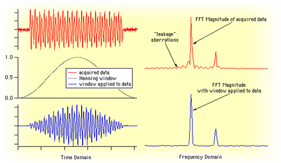
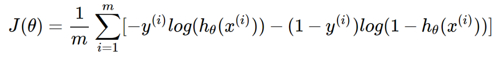
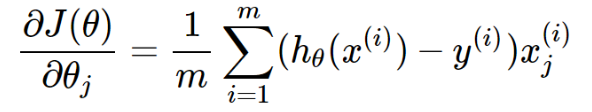

# Speech-Command-Recognition-MATLAB-

Three word classification between "Yes", "No" and "Marvin in MATLAB

Speech commands recognition in this case was made with help of using and modifying following code sources:
  1. Coursera Machine learning course by Stanford (Andrew Ng) - coursera_code
  2. Theodoros Giannakopolous, Aggelos Pikrakis, "Introduction to audio analysis: A MATLAB approach", First edition 2014 - audio_analysis_book_code
  
 Speech signal vectors were loaded in MATLAB using the LoadAudioData.m function, which creates a user interface for picking speech files to be read and arranged in a matrix of data.
Labels vector contains labels (1,2,3) for each of the loaded individual speech signals.
Each speech signal is divided in short time frames (which might or might not overlap) and multiplied with a windowing function called Hamming window. This enables the windowed signal to be stationary, so that it can be processed in a more "accurate" way, having less noisy frequency spectrum.

Feature extracting is done with TestingFeature.m function. Signal, sampling frequency, size of the (window) moving frame and step size of the moving frame are input data. It returns a matrix M x N, where M is the number of features, and N is the total number of short-term windows.
Features matrix is arranged in a way so that signals are represented with feature vectors, thus significantly reducing the amount of data. Cost function and gradient descent for logistic regression are then computed using the feature matrix as input data (x).

Method used for classification is Logistic Regression - OnevsAll, where feature vector for each sample is multiplied by optimized weights of 3 possible classes in this case. As a result, 3x1 column vector is received, where the largest element shows the predicted class. Weight optimization is done using conjugate gradient descent (fmincg.m). 

  
  Features used for testing:
  - Zero Crossing Rate
  - Energy
  - Energy entropy
  - Spectral Centroid
  - Spectral Spread
  - Spectral Flux
  - Spectral Entropy
  - Spectral Rolloff
  - Harmonic Ratio
  - Fundamental frequency
  
 
Function used for testing prediction: detect_command.m
